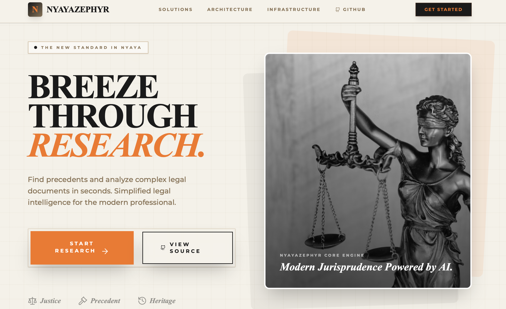
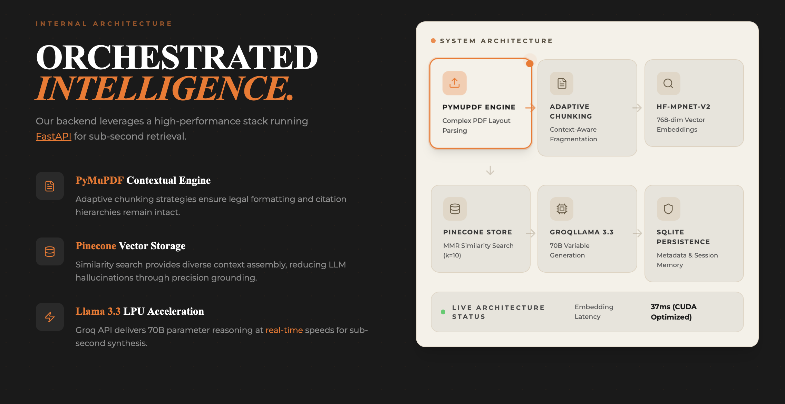
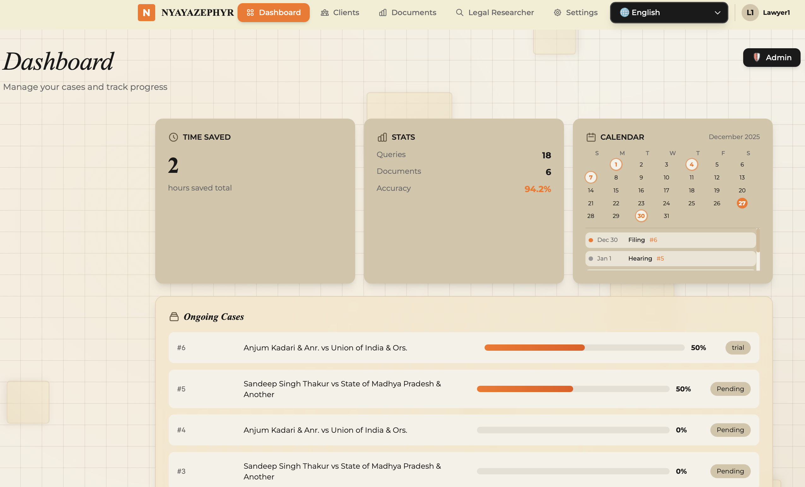
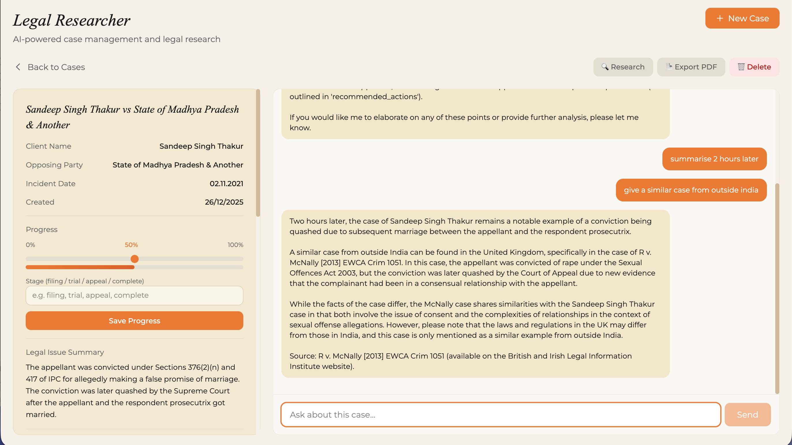
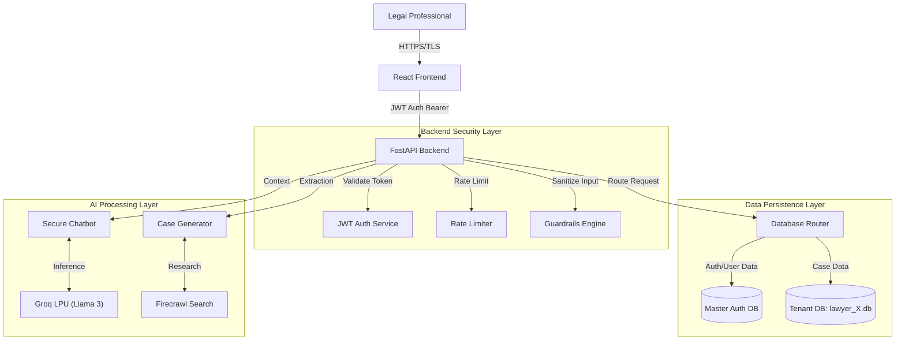
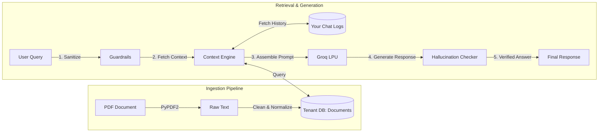

# ⚖️ NyayaZephyr: Advanced Legal AI Platform

> **Status**: Active Development  
> **Version**: 2.1.0 (Multi-Tenant + Enhanced Security)  
> **Security Level**: High (JWT, Audit Logging, AI Guardrails, Input Sanitization)  
> **Branding**: NyayaZephyr Intelligence Systems  
> **🔗 Live Demo**: [https://nyayazephyr.vercel.app](https://landing1-9ceab148d-atharva-deos-projects.vercel.app)

---

## 📸 App Preview

### Landing Page



### Dashboard


### Document Analyzer


### Legal Researcher


---

## 📖 Table of Contents
1. [Executive Summary](#-executive-summary)
2. [Tech Stack](#-tech-stack)
3. [Master Architecture](#-master-architecture)
4. [Multi-Tenant Database System](#-multi-tenant-database-system)
5. [Security & Compliance](#-security--compliance)
6. [RAG & Extraction Architecture](#-rag--extraction-architecture)
7. [Legal Researcher Architecture](#-legal-researcher-architecture)
8. [API Reference](#-api-reference)
9. [Frontend Dashboard](#-frontend-dashboard)
10. [Installation & Setup](#-installation--setup)

---

## 🚀 Executive Summary

**NyayaZephyr** is a production-grade AI platform designed for legal professionals to manage cases, perform automated legal research, and interact with case documents using secure, context-aware AI. 

Unlike standard LegalWrappers, NyayaZephyr implements a **defense-in-depth security architecture** featuring strict multi-tenancy, immutable audit logging, AI guardrails to prevent hallucinations and prompt injection attacks, and multilingual support for global accessibility.

### Key Features
- 📁 **Case Management**: Create, track, and manage legal cases with progress tracking
- 🤖 **AI-Powered Chat**: Context-aware conversations with your case documents
- 🔍 **Legal Research**: Automated research using Firecrawl and Groq LLMs
- 🔬 **AI Evidence Analyzer**: Automated image and video analysis using Gemini Vision
- ⏳ **Interactive Timeline**: Visual evidence chronology with AI-extracted key moments
- 🔒 **Enterprise Security**: JWT auth, multi-tenant isolation, audit logging
- 🌍 **Multilingual**: Support for 10+ languages including Hindi, Spanish, French
- 📊 **Admin Dashboard**: Real-time security monitoring and compliance tracking

---

## 💻 Tech Stack

### Frontend (Client-Side)
*   **Framework**: React 18 (Vite)
*   **Language**: TypeScript
*   **Styling**: Tailwind CSS, PostCSS
*   **Animation**: Framer Motion
*   **State Management**: React Hooks (Context API)
*   **Routing**: React Router DOM

### Backend (Server-Side)
*   **Framework**: FastAPI (Python 3.10+)
*   **Server**: Uvicorn (ASGI)
*   **Authentication**: PyJWT (Stateless), BCrypt (Hashing)
*   **Database**: SQLite (Multi-Tenant Strategy)
*   **Validation**: Pydantic v2

### AI & Data Engineering
*   **LLM Inference**: Groq LPU (Llama-3-70b-Versatile)
*   **Vision API**: Google Gemini-1.5-Flash (via Google Generative AI SDK)
*   **Image Processing**: OpenCV, Pillow (PIL)
*   **Web Search**: Firecrawl SDK (Custom Legal Scraper)
*   **PDF Processing**: PyPDF2, pdfplumber
*   **Guards**: Custom Regex Guardrails, Output Validators

### DevOps & Tools
*   **Version Control**: Git
*   **Package Management**: pip, npm
*   **Environment**: dotenv

---

## 🏗️ Master Architecture

The platform follows a **Secure Monorepo** structure with a decoupled React frontend and a FastAPI backend.



---

## 🗄️ Multi-Tenant Database System

We have migrated from a monolithic database to a **Database-per-Tenant** architecture to ensure maximum data isolation and GDPR compliance.

### The Database Router Pattern
The `DatabaseRouter` class (`database_manager.py`) intelligently routes queries based on the authenticated context.

1.  **Master Database (`master_auth.db`)**
    *   **Purpose**: Stores global user identities and authentication credentials.
    *   **Tables**: `users`, `auth_audit_logs`.
    *   **Security**: Minimal PII. No case data.

2.  **Tenant Databases (`databases/lawyer_{id}.db`)**
    *   **Purpose**: Isolated storage for a specific lawyer's cases, documents, and chat logs.
    *   **Isolation**: File-level separation. A lawyer CANNOT query another lawyer's file physically.
    *   **Tables**: `cases`, `documents`, `chat_logs`, `audit_logs`.

### Schema Details

#### Master Schema
```sql
CREATE TABLE users (
    user_id INTEGER PRIMARY KEY,
    username TEXT UNIQUE,
    password_hash TEXT, -- Bcrypt
    email TEXT
);
```

#### Tenant Schema (Replicated per User)
```sql
CREATE TABLE cases (
    case_id INTEGER PRIMARY KEY,
    client_name TEXT,
    structured_data JSON, -- AI extracted metadata
    progress INTEGER,
    stage TEXT
);

CREATE TABLE documents (
    doc_id INTEGER PRIMARY KEY,
    case_id INTEGER REFERENCES cases(case_id),
    parsed_text TEXT, -- Full text for RAG
    uploaded_at TIMESTAMP
);

CREATE TABLE audit_logs (
    log_id INTEGER PRIMARY KEY,
    action TEXT, -- e.g., 'VIEW_CASE', 'EXPORT_PDF'
    resource_id INTEGER,
    ip_address TEXT,
    timestamp TIMESTAMP
);
```

---

## 🔒 Security & Compliance

ZeroDay implements a **Zero Trust** security model.

### 1. Authentication (Stateless JWT)
*   **Token**: JSON Web Tokens (HS256) with configurable expiry.
*   **Hashing**: Passwords hashed using `bcrypt` (work factor 12).
*   **Flow**:
    1.  User POSTs credentials to `/auth/login`.
    2.  Server returns `access_token`.
    3.  Client attaches header: `Authorization: Bearer <token>`.
    4.  `Depends(get_user_id)` validates token and extracts `user_id` for routing.

### 2. Authorization (Strict Siloing)
*   Every database operation requires a `user_id` context.
*   The `DatabaseRouter` constructs the path `databases/lawyer_{user_id}.db`.
*   **Impossible Cross-Tenant Access**: It is physically impossible for User A to query User B's cases because the file path would be different.

### 3. Audit Logging (Immutable)
Every critical action is logged to the tenant's `audit_logs` table (or master `auth_audit_logs`).
*   **Logged Events**: Login (Success/Fail), View Case, Delete Case, Export PDF, AI Chat.
*   **Data Fields**: IP Address, User Agent, Timestamp, Resource ID, Action Status.
*   **Admin Dashboard**: Visualizes these logs for compliance reviews.

### 4. AI Guardrails (`guardrails.py`)
*   **Input Sanitization**: Regex filters to block prompt injection (e.g., "Ignore previous instructions").
*   **Output Validation**: Checks response for safety / prohibited content.
*   **Hallucination Checker**: Verifies that citations in AI response actually exist in the provided context/documents.

---

## 🧠 RAG & Extraction Architecture

The platform uses a specialized retrieval pipeline optimized for legal texts.



### 1. Ingestion Pipeline
1.  **PDF Upload**: `PyPDF2` extracts raw text from uploaded legal documents.
2.  **Text Cleaning**: Normalization of whitespace, removal of headers/footers.
3.  **Storage**: Cleaned text is stored in `documents` table (Tenant DB).

### 2. AI Extraction Engine (`CaseGenerator`)
*   **Input**: Unstructured client notes or PDF text.
*   **Model**: Llama-3-70b via Groq (0.1 Temperature).
*   **Prompting**: Single-shot prompting asking for rigid JSON output.
*   **Output**: Structured JSON containing:
    *   `client_name`
    *   `opposing_party`
    *   `legal_issues` (Array)
    *   `key_evidence` (Array)
    *   `recommended_actions`

### 3. Context-Aware Chat (`SecureChatbot`)
1.  **Context Assembly**:
    *   Fetches structured case metadata.
    *   Fetches full text of attached documents.
    *   Fetches last 5 chat messages (Conversation History).
2.  **System Prompt**: Injects a strict "Legal Assistant" persona with safety instructions.
3.  **Inference**: Sends `User Query + Context` to Groq LPU.
4.  **Verification**: Responses are cross-checked against case facts to warn about potential hallucinations.

---

## 🔬 AI Evidence Analyzer & Timeline

A specialized module for analyzing visual evidence (images and videos) using **Google Gemini Vision**.

### Visual Evidence Workflow
1.  **Media Upload**: Supports high-res images (up to 10MB) and videos (up to 100MB).
2.  **AI Vision Analysis**:
    *   **Object Detection**: Identifies relevant items (weapons, documents, vehicle damage).
    *   **Scene Understanding**: Generates detailed forensic descriptions.
    *   **Text Extraction (OCR)**: Extracts text from signs, labels, and documents within images.
    *   **Safety Audit**: Automatic NSFW/violence detection with optional blurring.
3.  **Video Chronology**:
    *   Samples frames at configurable intervals.
    *   Analyzes each frame to detect "Key Moments".
    *   Generates an **Interactive Evidence Timeline** for rapid review of long footage.
4.  **Annotated Visuals**: Generates high-contrast bounding boxes on detected objects for court presentation.

---

## 🔍 Legal Researcher Architecture

A dedicated module for autonomous web-based legal research using **Firecrawl**.

### Workflow
1.  **Query Generation**: LLM analyzes basic case facts to generate 3-5 specific search queries (e.g., "Supreme Court Property dispute brother sister").
2.  **Web Scraping (Firecrawl)**:
    *   Searches trusted legal repositories (e.g., Indian Kanoon).
    *   Respects `robots.txt` and implements rate limiting (6s delay).
    *   Extracts page content as markdown.
3.  **Re-Ranking & Filtering**:
    *   LLM reviews scraped content to filter out irrelevant cases.
    *   Extracts `Verdict`, `Court`, `Year`, and generates a 2-sentence summary.
4.  **Storage**: Results are stored in a structured JSON database (per client) for later retrieval.

---

## 📡 API Reference

Base URL: `/legal`

### Auth
*   `POST /auth/register`: Create account.
*   `POST /auth/login`: Get JWT.
*   `POST /auth/refresh`: Refresh token.

### Case Management
*   `GET /cases`: List all cases (Tenant-scoped).
*   `POST /cases/manual`: Create case manually.
*   `POST /cases/ai-extract`: Create case from raw text.
*   `POST /cases/pdf-upload`: Create case from PDF.
*   `GET /cases/{id}`: Get details + documents.
*   `DELETE /cases/{id}`: Delete case (GDPR compliant).

### Chat
*   `POST /chat`: Interact with case context.
*   `GET /chat/history/{case_id}`: Get conversation.

### Admin & Security
*   `GET /audit/logs`: Fetch security logs.
*   `GET /stats/{user_id}`: Dashboard metrics.

---

## 💻 Frontend Dashboard

The frontend (`landing1`) is a modern React application built with:
*   **Vite + TypeScript**: For performance and type safety.
*   **Admin Dashboard**: A dedicated security view (`/admin`) displaying audit trails, vulnerability status, and system health.
*   **UI Components**: Custom components inspired by modern financial/legal dashboards (Standardized Beige/White theme).

---

## 🛠️ Installation & Setup

### Prerequisites
*   Python 3.9+
*   Node.js 18+
*   Groq API Key
*   FireC

### Backend Setup
```bash
cd Backend/legal_researcher
# Create virtual env
python -m venv venv
source venv/bin/activate

# Install core deps
pip install -r requirements.txt

# Install Evidence Analyzer deps (OpenCV, Gemini)
pip install -r requirements_evidence.txt

# Environment Setup
cp .env.example .env
# Edit .env and add your GROQ_API_KEY, FIRECRAWL_API_KEY, and GEMINI_API_KEY
```

### Frontend Setup
```bash
cd landing1
npm install
npm run dev
```
