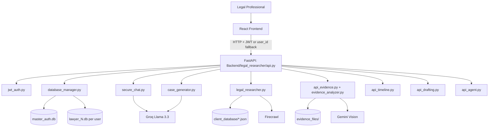

# NyayaZephyr - Legal AI Platform

NyayaZephyr is a full-stack legal operations and intelligence platform for case lifecycle management, AI-assisted legal research, evidence analysis, drafting support, and secure multi-tenant data handling.

It combines a React + TypeScript frontend with a FastAPI backend and multiple AI pipelines (LLM, vision, retrieval, and agentic orchestration).

## What This Project Solves

Legal teams typically use fragmented tools for:
- Case intake and tracking
- Legal research across jurisdictions
- Handling document and media evidence
- Drafting legal documents
- Maintaining auditability and tenant isolation

NyayaZephyr unifies these workflows into one system with:
- User-aware case management
- AI extraction from notes and PDFs
- Context-aware legal chat
- Indian and international research surfaces
- Visual evidence analysis (image/video)
- Interactive evidence timeline
- Drafting assistant with legal style constraints
- Audit logging and security controls

## Monorepo Structure

```text
hacknova-LegalAI/
├── README.md
├── Backend/
│   ├── legal_researcher/            # Main backend service (FastAPI)
│   │   ├── api.py                   # Core API app + router composition
│   │   ├── database_manager.py      # Multi-tenant DB router and schema ops
│   │   ├── jwt_auth.py              # JWT + flexible auth dependencies
│   │   ├── secure_chat.py           # Context-aware guarded chat
│   │   ├── legal_researcher.py      # Firecrawl + Groq case research
│   │   ├── api_evidence.py          # Evidence upload/analysis APIs
│   │   ├── api_timeline.py          # Timeline APIs
│   │   ├── api_drafting.py          # Drafting assistant APIs
│   │   ├── api_international.py     # eCourts, IndiaCode, GovInfo APIs
│   │   ├── api_agent.py             # Agent run APIs + state persistence
│   │   ├── evidence_analyzer.py     # Gemini vision analysis logic
│   │   ├── case_generator.py        # Structured case extraction + export
│   │   ├── guardrails.py            # Prompt/output/citation safety checks
│   │   ├── databases/               # master_auth.db + lawyer_{id}.db
│   │   ├── evidence_files/          # Stored image/video evidence
│   │   └── client_database/         # JSON research snapshots
│   ├── server.py                    # Legacy launcher (references Zephyr)
│   └── start_server.py              # Legacy launcher helper
├── landing1/                        # Frontend app (Vite + React + TS)
│   ├── src/
│   │   ├── App.tsx
│   │   ├── LegalResearcherPage.tsx
│   │   ├── EvidencePanel.tsx
│   │   ├── DraftingAssistant.tsx
│   │   ├── MultiSourceResearchPanel.tsx
│   │   └── api/                     # TS clients for backend APIs
│   └── package.json
├── render.yaml                      # Render deployment for backend API
└── test_workflow.py                 # End-to-end backend smoke workflow
```

## System Architecture



## Intended Workflow (Product Flow)

1. User authenticates (or Clerk sync is used in frontend-enabled deployments).
2. User creates a case via:
   - Manual form entry
   - AI extraction from raw notes
   - PDF upload + parsing + AI structuring
3. User works the case through:
   - Context-aware legal chat
   - Indian Kanoon import/search
   - Multi-source research (Acts + US case law + eCourts stats)
4. User uploads evidence (image/video):
   - Gemini analyzes media
   - Safety flags + findings are stored
   - Timeline events are created/managed
5. User drafts legal text in Drafting Assistant and saves back to case documents.
6. User exports case package and reviews audit/security telemetry.
7. Optional agent run can execute multi-step legal research workflows and persist run state.

## Core Features

### 1) Authentication and Identity
- Register/login endpoints
- JWT token issuance and validation
- Flexible auth dependency (`user_id` query fallback for development)
- Clerk sync endpoint for frontend identity bridging

### 2) Multi-Tenant Case Management
- Per-user tenant database files (`lawyer_{user_id}.db`)
- CRUD for cases and progress tracking
- Structured JSON case schema + raw narrative support
- Attachment/document persistence

### 3) AI Case Structuring
- Extracts structured legal fields from raw notes/PDF text
- Generates summaries and recommended actions
- Saves normalized case records for downstream chat/research

### 4) Context-Aware Legal Chat
- Pulls case metadata + document text + recent chat history
- Uses guardrails for input/output checks
- Citation verification against stored context
- Per-case chat history and summaries

### 5) Legal Research
- Indian research through Firecrawl scraping + ranking
- Case metadata extraction (court/type/date/verdict)
- Multi-source research APIs for:
  - eCourts statistics and notices
  - IndiaCode acts search/relevance analysis
  - US federal case law (GovInfo)

### 6) Evidence Intelligence
- Image/video upload with file validation
- Gemini-based scene/object/text extraction
- NSFW/safety warning flags
- Evidence gallery and annotated retrieval endpoints

### 7) Evidence Timeline
- Timeline listing by case
- Manual event creation
- Event annotation and update APIs

### 8) Drafting Assistant
- AI drafting suggestions based on case + evidence context
- Citation-style prompting (Bluebook-oriented)
- Save generated draft as case document

### 9) Agentic Research Execution
- Async run model with run IDs
- Persisted state in tenant DB (`agent_state` table)
- Step/tool-hop limits and execution logs
- Optional Google auth callback support for agent tools

### 10) Security and Auditability
- Password hashing with bcrypt
- JWT access tokens with expiry
- Guardrails against prompt injection and unsafe outputs
- Tenant and auth audit logs

## Backend API Surface (High-Level)

Base prefix: `/legal`

- Auth: `/auth/register`, `/auth/login`, `/auth/me`, `/auth/refresh`, `/auth/clerk-sync`
- Cases: `/cases/manual`, `/cases/ai-extract`, `/cases/pdf-upload`, `/cases`, `/cases/{id}`, `/cases/{id}/progress`, `/cases/import-kanoon`
- Chat: `/chat`, `/chat/history/{case_id}`, `/chat/summary/{case_id}`
- Export: `/export/{case_id}`
- Research: `/research`, `/research/history/{client_name}`, `/cases/search-kanoon`
- Multi-source: `/ecourts/*`, `/acts/*`, `/research/international`
- Evidence: `/evidence/analyze-image`, `/evidence/analyze-video`, and retrieval/delete routes
- Timeline: `/evidence/timeline/*`
- Drafting: `/drafting/suggest`, `/drafting/save`
- Agent: `/agent/*`
- Security/Admin: `/stats/{user_id}`, `/audit/*`, `/security/status`

Also available at app root:
- `/` (service metadata)
- `/health`
- `/docs` (OpenAPI UI)

## Data Architecture

### Master Database
- `master_auth.db`
- Stores global identity/auth data (`users`, `auth_audit_logs`)

### Tenant Databases
- `lawyer_{id}.db`
- Stores case, document, chat, evidence, timeline, search, and agent state data

This design provides file-level tenant isolation and simplifies per-tenant backup/deletion strategies.

## Tech Stack

### Frontend
- React 19 + TypeScript
- Vite 7
- React Router
- Clerk (optional auth integration)
- Framer Motion
- Tailwind CSS 4
- SWR / Fetch-based API clients

### Backend
- Python 3.10+ (3.11 recommended)
- FastAPI + Uvicorn
- Pydantic v2
- SQLite / libsql-experimental (Turso mode when configured)
- bcrypt + PyJWT

### AI and Data
- Groq Llama 3.3 for text generation/chat
- Firecrawl for legal web retrieval
- Gemini Vision for image/video evidence analysis
- PyMuPDF/PyPDF2 and OCR tooling for document ingestion

## Local Setup

### 1) Backend

```bash
cd Backend/legal_researcher

# Windows
python -m venv venv
venv\Scripts\activate

# macOS/Linux
# python3 -m venv venv
# source venv/bin/activate

pip install -r requirements.txt
pip install -r requirements_evidence.txt

# create env file
copy .env.example .env   # Windows
# cp .env.example .env   # macOS/Linux
```

Populate `.env` with:
- `GROQ_API_KEY`
- `FIRECRAWL_API_KEY`
- `GEMINI_API_KEY` (required for evidence analysis)
- `JWT_SECRET`
- optional: `HF_TOKEN`, Turso settings

Run backend:

```bash
uvicorn api:app --host 0.0.0.0 --port 8000 --reload
```

### 2) Frontend

```bash
cd landing1
npm install
npm run dev
```

Frontend defaults:
- Uses `http://localhost:8000/legal` for main legal API client
- Some modules call `http://localhost:8000` directly for specialized routes

Set env in frontend as needed:
- `VITE_API_URL=http://localhost:8000/legal`
- `VITE_CLERK_PUBLISHABLE_KEY=...` (optional)

## Deployment Notes

- `render.yaml` deploys backend from `Backend/legal_researcher` and starts `uvicorn api:app`.
- Frontend can be deployed independently (Vercel or static host).

## Testing and Verification

- `test_workflow.py` provides an integration-style backend workflow:
  - auth
  - case creation from PDF
  - evidence upload
  - chat query
- Additional backend tests and utility scripts exist under `Backend/legal_researcher`.

## Current Operational Notes

- The canonical backend entrypoint for this repo is `Backend/legal_researcher/api.py`.
- `Backend/server.py` and `Backend/start_server.py` reference a `Backend/Zephyr` path, which is not present in this workspace and should be treated as legacy scripts unless restored.
- CORS is currently permissive (`allow_origins=["*"]`) in standalone app mode; tighten for production.

## Roadmap Directions (Suggested)

- Harden production auth path to JWT-only (remove query fallback in production mode)
- Add role-based authorization for admin endpoints
- Expand automated tests for evidence/timeline/drafting flows
- Introduce structured migration tooling for tenant schema updates
- Add observability (metrics/tracing) for AI calls and long-running agent runs

## License

No license file is currently defined in this repository. Add a project license before public distribution.