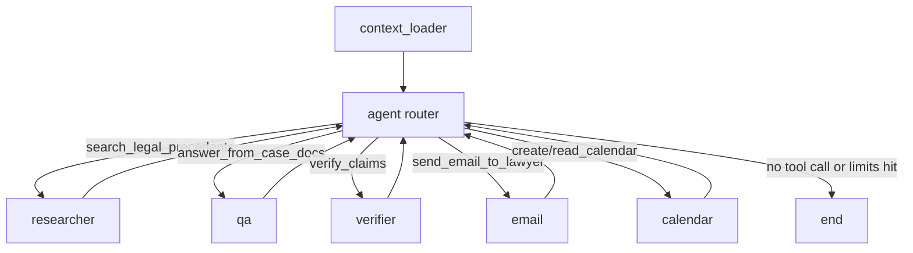

# NyayaZephyr Agent (Quick Overview)

## What it does
- Loads case context and documents for a user/case.
- Uses an LLM router to decide whether to answer directly or call a tool.
- Executes specialized nodes for research, QA, verification, email, and calendar actions.
- Loops back to the router until completion or budget limits are reached.

## Core architecture
- State machine: LangGraph (`StateGraph`) with shared `AgentState`.
- Entry node: `context_loader`.
- Router node: `agent` (LLM with bound tools).
- Worker nodes:
  - `researcher` -> Indian Kanoon precedent retrieval
  - `qa` -> answer from case docs/context
  - `verifier` -> claim verification
  - `email` -> Gmail send (if OAuth creds exist)
  - `calendar` -> Google Calendar read/create (if OAuth creds exist)
- Guardrails:
  - Step budget: `max_steps`
  - Tool-hop budget: `max_tool_hops`
  - Missing tool call or limit reached -> end

## Graph

